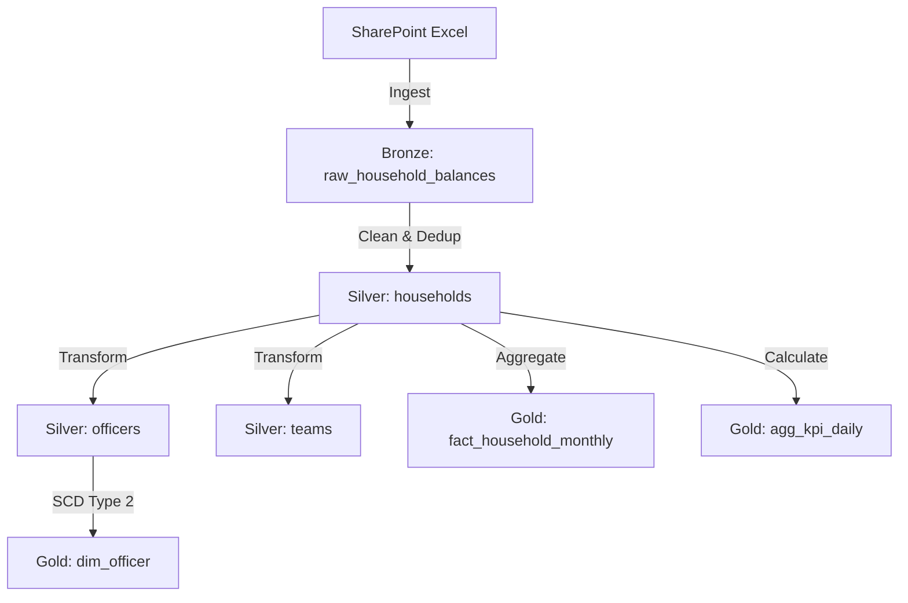

# Data Lineage Documentation

## Overview
This document outlines the ETL pipeline lineage for the Oxford Nexus Lakehouse, tracing data from ingestion (SharePoint) through transformation (Silver) to aggregation (Gold).

## Pipeline Architecture
**Schedule**: `0 2 * * *` (2:00 AM EST)
**Runner**: Azure Container Apps Jobs
**Tech Stack**: Python 3.13, DuckDB, Polars, Delta Lake

## Stage Details

### 1. Ingestion (Source -> Bronze)
*   **Source**: `sharepoint/drive/items/{file_id}`
*   **Target**: `bronze.raw_household_balances`
*   **Tool**: DuckDB
*   **Process**:
    1.  Download `household-balance-report.xlsx` to temp storage.
    2.  Read Excel file using DuckDB spatial/excel extension.
    3.  Add metadata: `ingestion_id`, `source_filename`, `ingestion_timestamp`.
    4.  Store full row as JSON in `raw_content`.

### 2. Silver Transformation (Bronze -> Silver)
*   **Input**: `bronze.raw_household_balances`
*   **Target**: `silver.households`, `silver.officers`, `silver.teams`
*   **Tools**: Polars, Pydantic
*   **Process**:
    1.  **Validation**: Pydantic `HouseholdSchema` validates types and formats (e.g., household_id regex).
    2.  **Quarantine**: Invalid rows are rejected (TODO: Quarantine table).
    3.  **Merge**: Upsert logic based on `household_id` and `as_of_date`, prioritizing the latest ingestion.

### 3. Gold Aggregation (Silver -> Gold)
*   **Input**: Silver Tables
*   **Target**: `gold.fact_household_monthly`, `gold.agg_kpi_daily`
*   **Tool**: DuckDB
*   **Process**:
    1.  **Facts**: Aggregate daily balances into monthly snapshots (`fact_household_monthly`).
        *   Metrics: `total_deposits`, `net_flow_mom`, `net_flow_ytd`.
    2.  **KPIs**: Pre-calculate dashboard indicators (`agg_kpi_daily`).
        *   Dimensions: Bank, Team, Officer.
        *   Metrics: `total_deposits`, `net_flow_mom`.

## Data Quality Checks
*   **Freshness**: Assert `max(ingestion_timestamp) > now() - 24h`.
*   **Volatility**: Assert `abs(sum(net_flow_mom)) < (sum(total_deposits) * 0.10)`.
